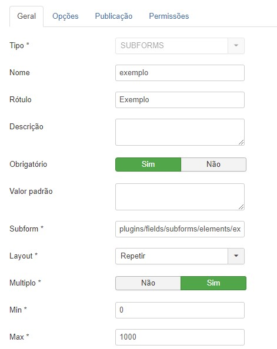

<h1 align="center">
    
</h1>

<h2 align="center">
  :rocket: Projeto: Plugin SubForms
</h2>

</h2>

  <a href="#computer-projeto">Projeto</a>&nbsp;&nbsp;&nbsp;|&nbsp;&nbsp;&nbsp;
  <a href="#rocket-tecnologias">Tecnologias</a>&nbsp;&nbsp;&nbsp;|&nbsp;&nbsp;&nbsp;
  <a href="#information_source-como-usar-?">Como usar ?</a>

      

  

## :computer: Projeto

<strong>O Plugin SubForm</strong> é um projeto que tem como objetivo fornecer ao joomla a possibilidade de criar um campo (field) customizado que referencia um arquivo <strong>.xml</strong>

É possivel referenciar um arquivo .xml dentro de qualquer diretorio no joomla, aumentando as possibilidades de personalização e utilização de campos custom nativos do joomla.

## :rocket: Tecnologias

### Joomla

## :information_source: Como usar ?

### Front-End ReactJS

- Instale o joomla (versão 3.9.24 + )
- Compacte os arquivos
- Na parte administrativa do joomla, acesse Extensões > Gerenciar > Instalar
- Arraste o arquivo compactado .zip e aguarde o joomla realizar a instalação.
- Quando concluir, crie um campo custom, clique em Conteúdo > Campos.
- Clique em Novo, no tipo de campo escolha SubForms.
- Alguns campos serão exibidos, preencha o campo Subform com o caminho do .xml, exemplo: plugins/fields/subforms/elements/exemplo.xml
- Defina o layout do subform.
- Defina se podera existir um ou N itens.
- Defina a quantidade minina e maxima.
- Defina o grupo de campos caso tenha e a categoria.
- Salve o campo criado e você podera utilizar em seu artigo.
